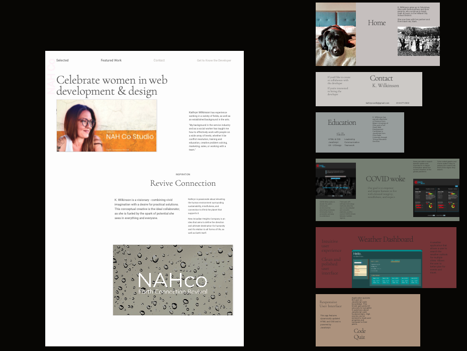
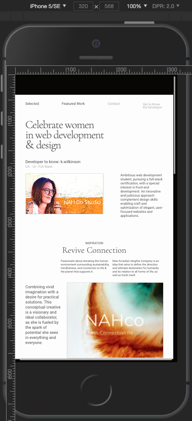
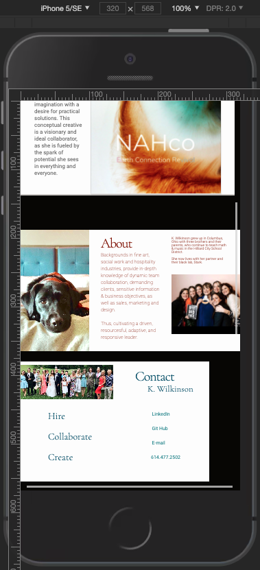
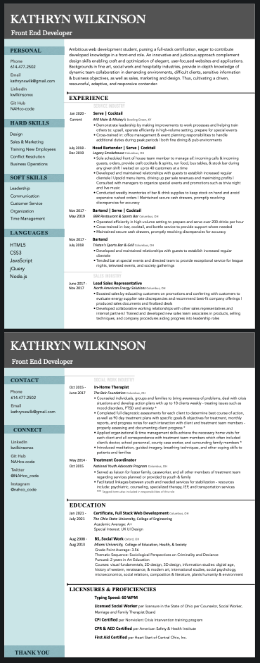

# Web Developer Portfolio

Ambitious web development student, pursing a full-stack certification, eager to contribute developed knowledge in a front-end role. An innovative and judicious approach complement design skills enabling craft and optimization of elegant, user-focused websites and applications. Backgrounds in fine art, social work and hospitality industries, provide in-depth knowledge of dynamic team collaboration in demanding environments, difficult clients, sensitive information & business objectives, as well as sales, marketing and design.  Thus, cultivating a driven, resourceful, adaptive, and responsive contender.

## Features

According to developer's personal style preferences and showcasing skills in web design, this page is currently manipulated with the use of html and css only. Resume & Contact links open in new tab. Responsive display across viewport sizes.

## Roadmap

Incomplete styling due to concept change. JavaScript will be applied to implememnt a carosel or slideshow feature for the cards, as well as corresponding navigation links.

### Visuals

### Links

[DeployedApp(GitHubPages)](https://nahco-code.github.io/Portfolio-branded/)
[GitHubRepo](https://github.com/NAHco-code/Portfolio-branded.git)
[GitHubBranch-revised-concept](https://github.com/NAHco-code/Portfolio-branded.git)
